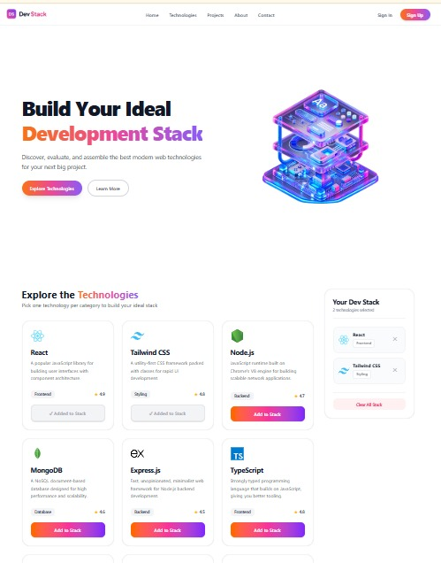

# 🚀 DevStack - Technology Stack Builder

A modern, interactive, and responsive web application designed for developers to discover, organize, and manage their favorite technology stacks. Effortlessly curate your personalized toolkit from a wide range of frontend, backend, and DevOps tools.

🔗 **Live Demo:** [Visit DevStack Live](https://devstack-nader.vercel.app/)

---

## 🛠️ Technologies Used

- **Core Library:** React.js (Powered by Vite)
- **Language:** TypeScript / JavaScript (ES6+)
- **Styling:** Tailwind CSS
- **Icons & UI Elements:** Lucide React / React Icons
- **Notifications:** React-Toastify

---

## ✨ Key Features

- 🔍 **Interactive Tech Selection:** Browse through a rich directory of popular web, mobile, and backend technologies with clean visual indicators.
- ⚡ **Dynamic Stack Management:** Add or remove technologies from your stack in real-time with automatic duplicate prevention and instant Toast notifications.
- 📱 **Responsive & Modern UI:** Designed with smooth gradient styling, an optimized sticky header navigation, and full mobile responsiveness.

---

## 💡 React Questions & Answers

### 1. What is JSX, and why is it used in React?
**Answer:** JSX (JavaScript XML) is a syntax extension for React that lets us write HTML-like code inside JavaScript. It makes writing UI components intuitive and readable, allowing dynamic JavaScript expressions to be embedded directly within markup using `{}`.

---

### 2. What is the difference between props and state?
**Answer:** 
- **Props (Properties):** Read-only data passed down from a parent component to a child component. The child cannot modify its props.
- **State:** Internal dynamic data managed within a component that can change based on user interactions and triggers a re-render when updated.

---

### 3. What does the `useState` hook do, and where did you use it in this project?
**Answer:** The `useState` hook allows functional components to create, manage, and update local reactive state. In this project, it was used inside `TechGrid.tsx` to store and manage the array of selected technologies in `selectedTechs`.

---

### 4. What does the `useEffect` hook do, and why did you need it to load the JSON data?
**Answer:** `useEffect` handles side effects in React components, such as data fetching or DOM updates. In this project, it was used to fetch technology data from `/technologies.json` when the component first mounts, ensuring asynchronous loading after render.

---

### 5. Why does every item in a `.map()` list need a unique `key` prop?
**Answer:** React uses the unique `key` prop to identify which items in a list have changed, been added, or removed. This optimizes DOM re-rendering performance and avoids state inconsistencies.

---

### 6. What is conditional rendering? Show one place you used it.
**Answer:** Conditional rendering means showing or hiding UI elements based on specific logical conditions. In this project, it was used in the `StackSidebar` component to render an *"Empty Stack"* message when no technology is selected (`selectedTechs.length === 0`).

---

### 7. How do you pass data from a parent component to a child component, and how does a child send something back to the parent?
**Answer:** 
- **Parent to Child:** Data is passed down through **props** directly as attributes (e.g., `<TechCard tech={item} />`).
- **Child to Parent:** The parent passes a **callback function** as a prop to the child, and the child executes that function with arguments to send data back up to the parent.

---

## 📄 License

Distributed under the MIT License.

---

  Built with ❤️ using <b>React & Tailwind CSS</b> • © 2026 <a href="https://linkedin.com/in/naderarrahman" target="_blank">Nader Ar Rahman</a>

